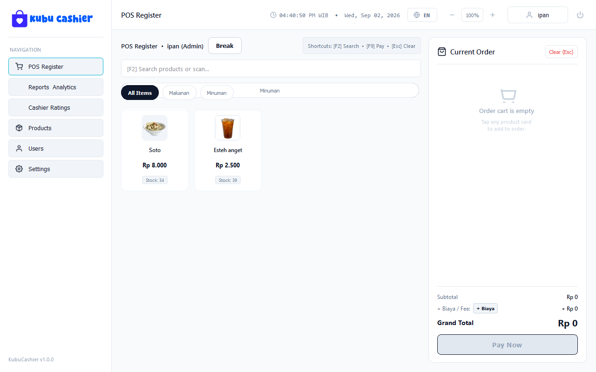
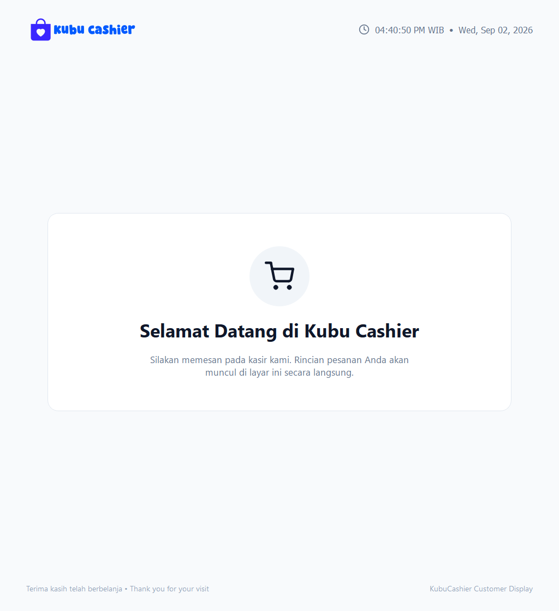
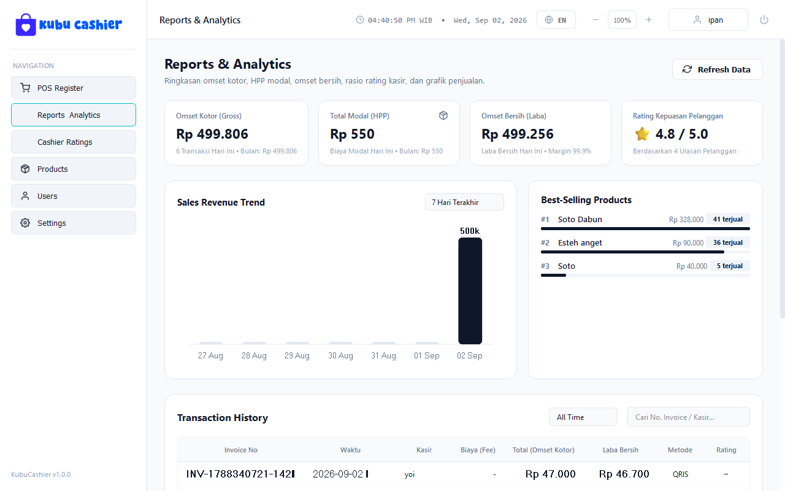
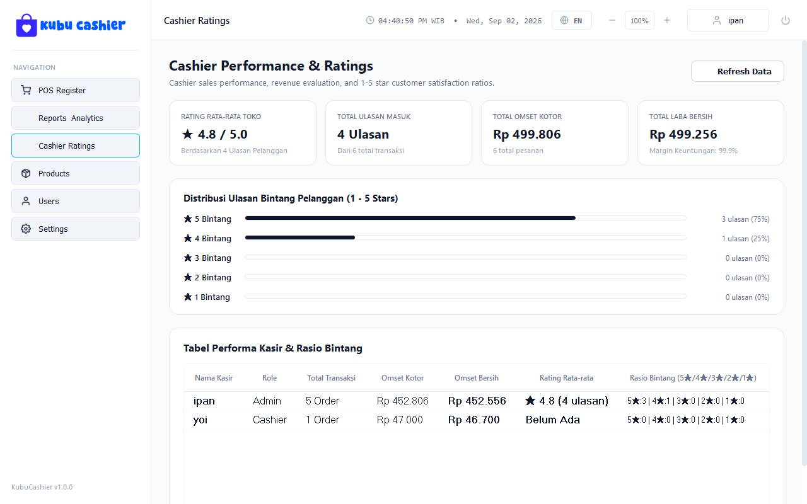
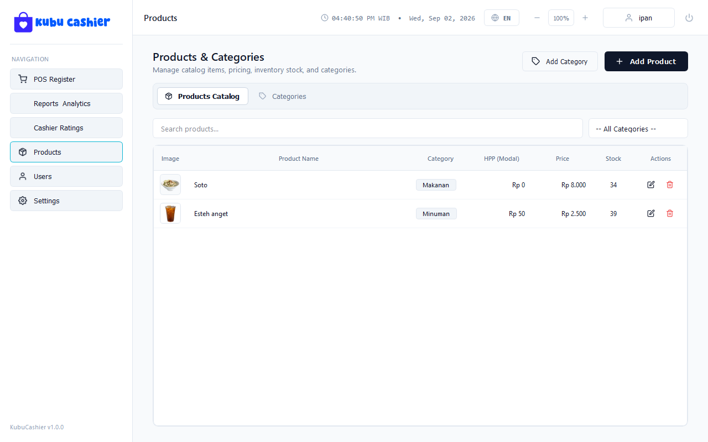
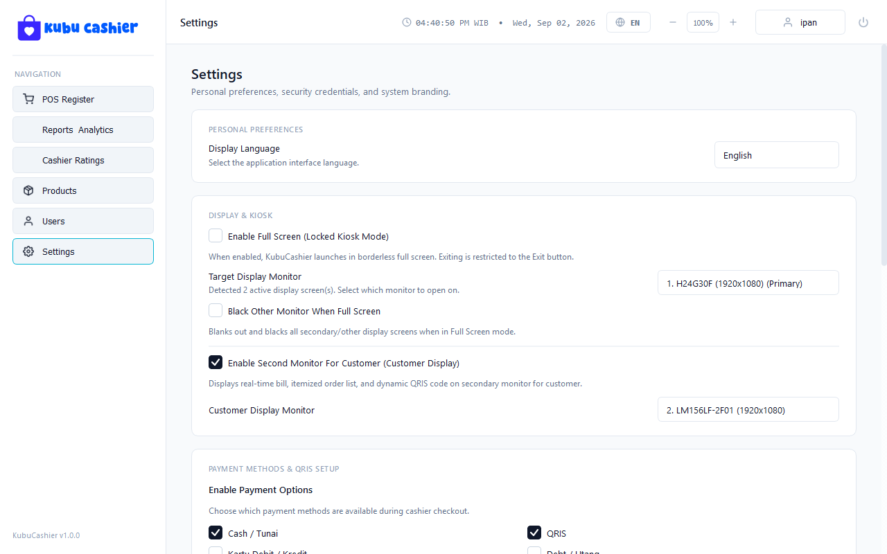

# KubuCashier (v1.0.0)

<p align="center">
  
</p>

<p align="center">
  <strong>Modern, High-Performance Dual-Screen Point of Sale (POS) & Kiosk Register Desktop Application.</strong>
</p>

<p align="center">
  
  
  
  
  
</p>

---

## 🌟 Key Features
Default Credential token can be set on .env (same directory with .exe):
```admin```

### 🛒 High-Speed POS Register
- **Keyboard-First Shortcuts**: Instant product search (`F2`), quick checkout (`F9`), and transaction cancel / clear cart (`Esc`).
- **Custom Order Fees (Biaya)**: Supports percentage rates (`0.7%`, `1.0%`, `11.0%`, `12.0%`) and fixed amounts (`Rp 500`, `Rp 1.000`, `Rp 3.000`, `Rp 5.000`) with persistent checkout memory.
- **Cashier Break Mode (`Istirahat`)**: Pause POS terminal and automatically update the customer display with a welcoming break status.

### 🖥️ Dual-Screen Customer Facing Display (CFD)
- **Live Cart Synchronization**: Real-time mirrored checkout with clear, high-visibility typography for counter distance viewing.
- **Dynamic QRIS Generation**: Converts static merchant QR payloads into instant dynamic payment codes matching exact invoice totals.
- **Big Change Calculation (`Kembalian`)**: Prominent green badge showing exact customer change immediately after cash payment.
- **Interactive 1–5 Star Customer Rating**: Touch/mouse-driven star feedback recorded directly to cashier performance metrics.

### 📊 Analytics, Profit & Ratings
- **Omset Kotor vs. Omset Bersih**: Automatic profit margin calculations based on Product HPP (*Harga Pokok Penjualan*).
- **Interactive Best Sellers Chart**: Visual bar charts tracking top-performing catalog items.
- **Cashier Ratings Breakdown**: Dedicated analytics view displaying 1-to-5 star distribution, average ratings, and cashier sales ratios.
- **Transaction Pagination & Wipe Data**: View latest 10 transactions with clean pagination and a secured transaction purge tool in Settings.

### ⚙️ System & Hardware Management
- **Hardware Monitor Detection**: Auto-detects connected displays, EDID monitor models (e.g. `H24G30F`, `LM156LF-2F01`), native resolutions, and primary displays.
- **Locked Fullscreen Kiosk Mode**: Borderless fullscreen kiosk operation with secure exit password protection.
- **Bilingual Support**: Instant runtime language switching between **English (EN)** and **Bahasa Indonesia (ID)**.

---

## 📸 Screenshots Gallery

| POS Register | Customer Facing Display (CFD) |
|:---:|:---:|
|  |  |

| Reports & Analytics (Omset Bersih / HPP) | Dedicated Cashier Ratings |
|:---:|:---:|
|  |  |

| Products Catalog with HPP Margins | Settings & Monitor Detection |
|:---:|:---:|
|  |  |

---

## ⌨️ Keyboard Shortcuts Reference

| Key | Action | Context |
|:---|:---|:---|
| <kbd>F2</kbd> | Focus Product Search / Barcode Input | POS Register |
| <kbd>F9</kbd> | Open Checkout & Payment Dialog | POS Register |
| <kbd>Esc</kbd> | Cancel Transaction / Clear Cart / Close Dialog | POS Register / Dialogs |
| <kbd>Ctrl</kbd> + <kbd>+</kbd> | Zoom In (+10% UI Scale) | Global Dashboard |
| <kbd>Ctrl</kbd> + <kbd>-</kbd> | Zoom Out (-10% UI Scale) | Global Dashboard |

---

## 🚀 Quick Start & Installation

### Prerequisites
- Windows 10 or Windows 11 (64-bit)
- Python 3.10+ (if running from source)

### Running from Source
```powershell
# 1. Clone the repository
git clone https://github.com/promptdrake/kubucashier.git
cd kubucashier

# 2. Install required dependencies
python -m pip install -r requirements.txt

# 3. Launch KubuCashier
python main.py
```

### Configuration (`.env`)
Copy `.env.example` to `.env` to configure initial system tokens and hardware monitors:
```ini
PASSWORD=admin
FULLSCREEN=false
OPEN_IN_MONITOR=1
CUSTOMER_DISPLAY_ENABLED=true
CUSTOMER_DISPLAY_MONITOR=2
LANGUAGE=id
```

---

## 📄 Commercial License

```text
Single-Outlet Commercial License

The software is licensed for use by one business entity at one physical outlet/location.

The license may be used on devices operating exclusively for that licensed outlet.

Use of the software at additional branches, outlets, stores, or business locations requires a separate license for each location.

Redistribution, resale, sublicensing, modification for redistribution, or providing the software as a service to third parties is prohibited without written permission from the copyright holder.

© 2026 Aisbir Cloud Nusantara. All rights reserved.
```
